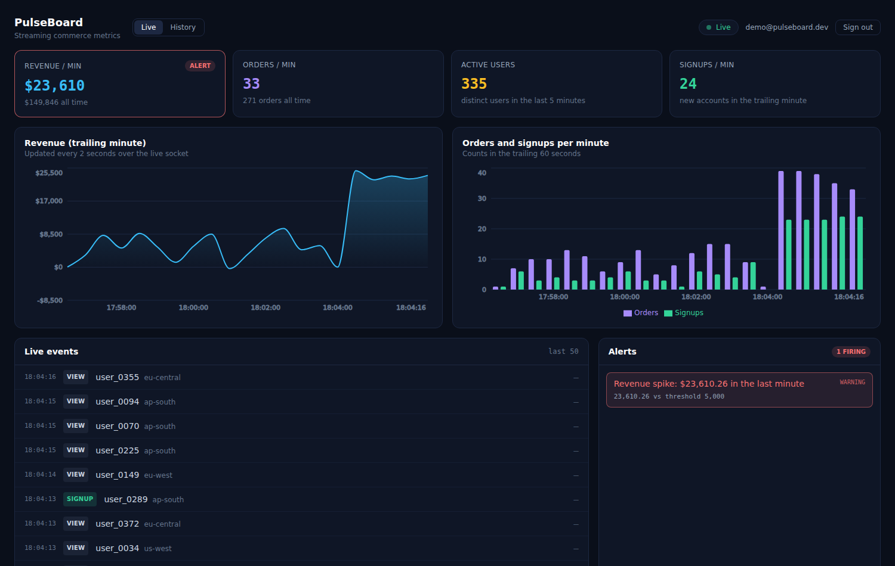
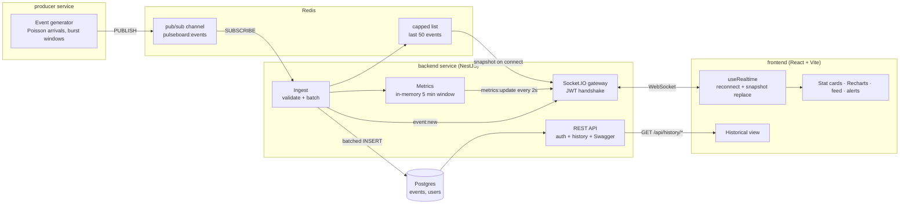
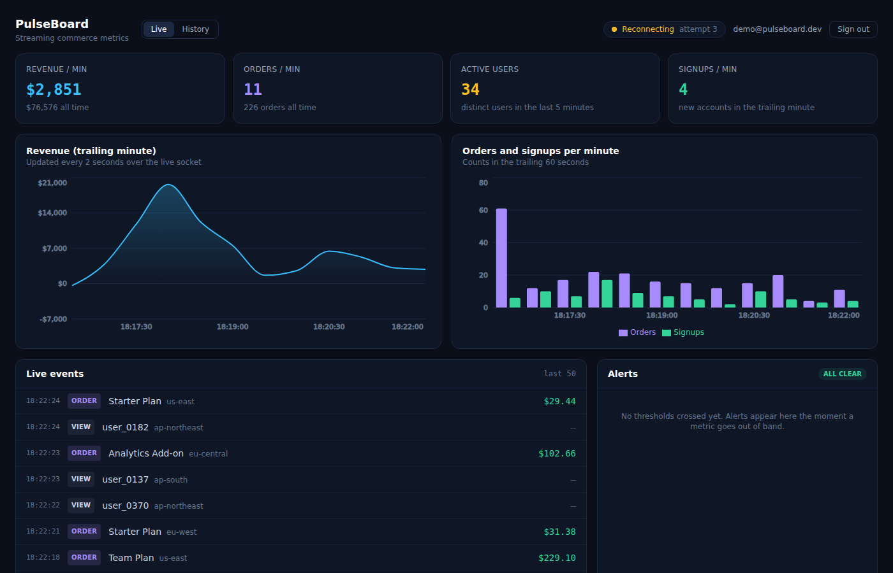
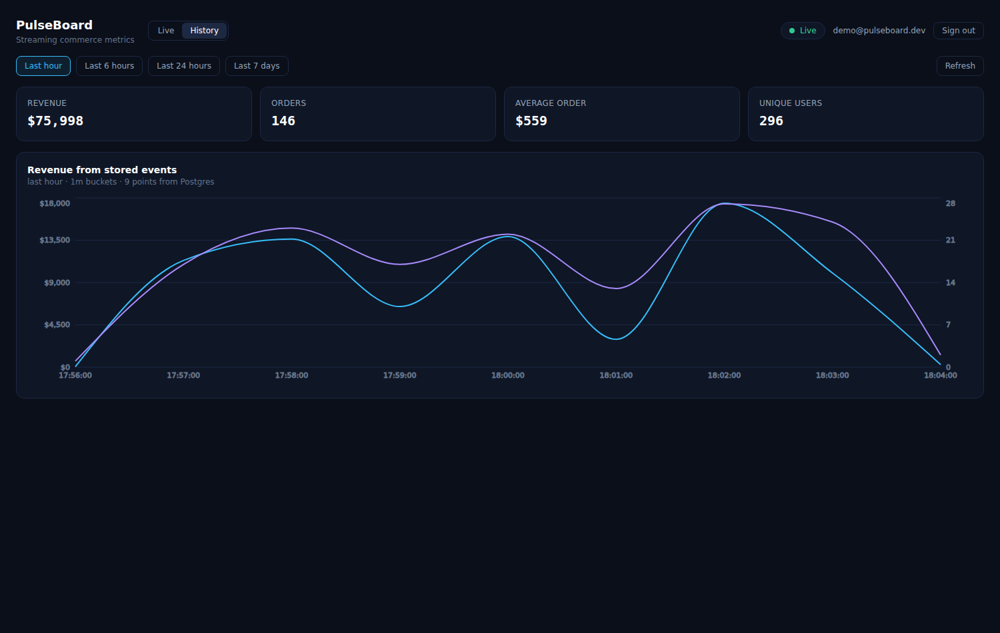

# PulseBoard

A live business-metrics dashboard: synthetic commerce events are generated by a
producer service, published to Redis, consumed by a NestJS backend that persists
them to Postgres, and pushed to the browser over an authenticated WebSocket. The
charts, the stat cards and the activity feed move on their own. Nothing polls,
and nothing refreshes.



## What it demonstrates

- **Streaming end to end** — producer → Redis pub/sub → backend consumer →
  Socket.IO → React, with the browser never asking for an update.
- **Stored data too** — the same events are batched into Postgres and queried
  back through a time-bucketed aggregation endpoint, so the app proves both
  halves, not just the live tail.
- **Auth on both transports** — one JWT guards the REST API and the socket
  handshake. An unauthenticated socket is disconnected before it joins the room.
- **Behaviour under failure** — reconnection with backoff, snapshot-on-connect
  so a client that was away comes back correct, malformed events dropped without
  killing the subscription, and a database outage that degrades history rather
  than taking the live view down.

## Architecture



Three services, one contract. The event shape in
`backend/src/common/pulse-event.ts` is mirrored in `producer/src/types.ts` and
`frontend/src/types.ts` — duplicated on purpose, so the producer can be replaced
by a real event source without the backend depending on it.

## Quick start

```bash
git clone https://github.com/vishalreddy9514/pulse_board.git
cd pulse_board
cp .env.example .env
docker compose up --build
```

Then open <http://localhost:5173> and sign in with the seeded account:

```
demo@pulseboard.dev / demo1234
```

Within a few seconds the cards start moving, the feed fills, and the charts draw
a line. The API docs are at <http://localhost:4000/api/docs>.

| Service  | URL                             |
| -------- | ------------------------------- |
| Dashboard | http://localhost:5173          |
| API       | http://localhost:4000          |
| Swagger   | http://localhost:4000/api/docs |
| Health    | http://localhost:4000/api/health |

### Running without Docker

Postgres 16 and Redis 7 need to be reachable; everything else is npm.

```bash
# terminal 1 — backend
cd backend && npm install && cp ../.env.example .env && npm run start:dev

# terminal 2 — producer
cd producer && npm install && npm run start:dev

# terminal 3 — frontend
cd frontend && npm install && npm run dev
```

Point `DATABASE_URL` and `REDIS_URL` at your local instances. The backend
applies its schema on boot, so there is no migration step to remember.

## Project layout

```
backend/     NestJS API, Redis consumer, Socket.IO gateway, JWT auth
  src/auth       registration, login, token verification, route guard
  src/events     ingest (Redis → Postgres), history queries, REST controller
  src/metrics    trailing-window aggregates and threshold alerting
  src/realtime   the WebSocket gateway
  test/          integration suite against real Redis and Postgres
producer/    synthetic event generator publishing to Redis
frontend/    React + Vite + Tailwind + Recharts dashboard
deploy/      ECS task definition and a deployment guide for AWS and Azure
```

## API

Everything except `/api/health` and the two auth endpoints requires
`Authorization: Bearer <token>`. Full schemas live in Swagger at `/api/docs`.

| Method | Path | Purpose |
| ------ | ---- | ------- |
| `POST` | `/api/auth/register` | Create an account, receive a JWT |
| `POST` | `/api/auth/login` | Exchange credentials for a JWT |
| `GET` | `/api/auth/me` | The account behind the current token |
| `GET` | `/api/history/series` | Time-bucketed metrics (`from`, `to`, `bucketSeconds`) |
| `GET` | `/api/history/summary` | Totals for a range |
| `GET` | `/api/history/events` | Raw events, newest first, filterable by type |
| `GET` | `/api/health` | Liveness plus Postgres and Redis reachability |

### WebSocket protocol

Connect to the same origin with the JWT in the handshake:

```ts
io('http://localhost:4000', { auth: { token } });
```

| Message | Direction | Payload |
| ------- | --------- | ------- |
| `snapshot` | server → client, once per connect | current metrics, recent events, seeded chart history |
| `event:new` | server → client, per event | a single `PulseEvent` |
| `metrics:update` | server → client, every 2s | aggregates plus one chart point |
| `alert:raised` | server → client, on a new breach | the alert that just fired |
| `auth:error` | server → client, then disconnect | why the handshake was refused |

The client sends nothing but the handshake. That asymmetry is the whole point:
the server knows when there is something to say.

## Key real-time engineering decisions

**WebSockets rather than polling.** A dashboard is a fan-out problem: one event
matters to every connected client, and clients have no idea when it will happen.
Polling makes both sides guess. At a 2s poll, 50 dashboards generate 25 requests
a second whether or not anything changed, each paying a full HTTP round trip and
re-authenticating, and the data is still up to 2s stale. A WebSocket inverts it:
one handshake, then the server writes a frame the moment an event arrives.
Latency drops to the network, and the cost of an idle dashboard is a socket and a
ping every 25 seconds. The fallback matters too — Socket.IO keeps long-polling
available for networks that break upgrades, which is worth more than the small
protocol overhead it costs.

**Redis pub/sub between producer and backend.** The producer should not know the
backend exists, or how many of it there are. Pub/sub gives complete decoupling —
the producer publishes to a channel and is finished, and the API can restart,
scale out or be redeployed without the producer noticing. It also means the
synthetic producer can be swapped for a real event source, or several, with no
backend change. Pub/sub is fire-and-forget, which is the right trade for live
metrics: an event lost during a restart costs one point on a chart, and the
durable copy lives in Postgres. When the events being dropped are ones you must
never lose, the same code moves to a Redis Stream with a consumer group, which
is the honest upgrade path rather than pretending pub/sub is durable.

**Reconnection is snapshot-based, not gap-based.** The frontend uses Socket.IO's
exponential backoff (500ms, doubling, capped at 10s, jittered, retrying
indefinitely) and the UI says which state it is in rather than pretending to be
live. The important part is what happens *after* the socket comes back: the
server sends a full snapshot on every successful handshake, and the client
replaces its state with it instead of appending. A client that was offline for a
minute therefore shows the truth immediately, with no stale prefix, no gap in the
middle of a chart and no replay logic to get wrong. The snapshot is assembled
from the Redis cache of recent events and a Postgres query for chart history, so
a reconnecting dashboard looks identical to one that has been open all day.



While the connection is down the UI says so and the feed simply stops; it never
invents a data point to fill the gap.

An expired or forged token is treated differently from a network drop: the server
disconnects it, the client stops retrying and the user is sent back to the login
screen. Retrying a request that can never succeed is just a slower failure.

**Aggregates on a tick, events immediately.** Individual events are forwarded the
instant they arrive, because a feed that lags is a feed nobody trusts. Summary
numbers are recomputed and broadcast on a fixed 2s tick instead of per event:
pushing them hundreds of times a second would spend CPU and bandwidth on frames
no human can read, and would make the charts jitter. Two different update
policies for two different kinds of data, in the same connection.

**Trailing windows in memory, history in Postgres.** "Revenue in the last 60
seconds" is recomputed several times a second for every connected client. Asking
Postgres that question on a repeating timer is a self-inflicted load problem, so
the backend keeps a bounded 5-minute window of events in memory and answers from
it in microseconds. Postgres stays the source of truth for lifetime totals —
which are read back at boot, so a restart does not reset the cards — and for
everything the historical view asks for.

**Writes are batched; the live path never waits on them.** Ingest updates the
in-memory metrics and fans the event out first, then queues it for persistence.
Inserts flush every 250ms or every 200 events as one multi-row statement, so a
busy stream costs one round trip per batch rather than one per event. Inserts use
`ON CONFLICT (id) DO NOTHING`, which makes redelivery harmless and lets several
backend instances consume the same channel without corrupting history. A failed
batch is logged and dropped rather than killing the subscription: losing history
is bad, but a dashboard that stops updating because the database hiccuped is
worse.

**Alerts are stateful, so they announce rather than nag.** Thresholds are
evaluated on every tick, but a breach is pushed only the first time it is seen;
a condition that stays true for a minute produces one alert, not thirty. Drop
alerts are suppressed during a 60-second warm-up, because a process that has just
started has no business claiming revenue collapsed. The panel shows what is
firing now and what fired earlier in the session, which is the difference between
an alert and a log line.

**One token, both transports.** The socket handshake and the HTTP guard call the
same `AuthService.verify`, so a token is accepted on exactly the same terms
whichever door it arrives at. The socket is authenticated during the handshake,
before it joins the broadcast room, so an unauthenticated connection never
receives a single byte of business data. The integration suite asserts exactly
that, with a missing token and with a forged one.

## Testing

```bash
cd backend  && npm test                 # 48 unit tests
cd backend  && npm run test:integration # 6 tests against real Redis + Postgres
cd frontend && npm test                 # 27 component and hook tests
cd producer && npm test                 # 9 generator tests
```

The integration suite needs the infrastructure up (`docker compose up postgres
redis` is enough). It boots the real Nest application, opens a real Socket.IO
connection, publishes an event to Redis from outside the app and asserts that it
reaches the browser socket *and* lands in Postgres — the test that catches a
broken subscription, a broken handshake or a serialisation change.

What the suites cover:

- **Backend** — rolling-window maths, alert raise and clear semantics, the
  warm-up rule, login and registration including timing-equal failures for
  unknown accounts, token verification against a foreign secret, history range
  and bucket guards, batch-insert parameter alignment, and rejection of every
  shape of malformed event.
- **Frontend** — the feed's rendering and ordering, the alert panel's firing and
  cleared states, stat-card alerting, the login flow with a mocked API including
  network failure, and the realtime hook's reconnect, snapshot-replacement,
  series-capping and unauthorized handling.
- **Producer** — event well-formedness, revenue signs, the fixed user pool and
  the Poisson arrival spacing.

## CI

[`.github/workflows/ci.yml`](.github/workflows/ci.yml) runs on every push and
pull request: lint, unit tests and a build for each of the three packages, the
integration suite against Postgres and Redis service containers, and a container
image build for all three Dockerfiles once the rest is green.

## Deployment

See [`deploy/README.md`](deploy/README.md) for AWS ECS Fargate and Azure App
Service walkthroughs, the environment-variable contract, the two load-balancer
settings that WebSockets actually need, and what changes when you run more than
one backend instance.



## Known limitations and what I would do next

- **Pub/sub is lossy by design.** Events published while the backend is
  restarting are gone. Moving to a Redis Stream with a consumer group makes the
  transport durable and gives at-least-once delivery, which the idempotent
  insert already tolerates.
- **No rate limiting on the auth endpoints.** A real deployment wants
  `@nestjs/throttler` in front of login, plus refresh tokens so the access token
  can be short-lived. Today a token is valid for 12 hours and cannot be revoked
  short of rotating the signing secret.
- **The events table grows without bound.** At the producer's default rate that
  is about 170k rows a day. Monthly partitions plus a retention policy, or a
  rollup table for anything older than a week, is the next change the historical
  queries would need.
- **The browser path is not covered in CI.** The component tests and the
  integration suite meet in the middle but never in a real browser; a Playwright
  run that logs in and asserts the numbers move would close that gap.
- **Metrics are per-instance.** See the scaling notes in `deploy/README.md` —
  correct at any instance count, but a freshly started instance shows a
  partially filled window for its first five minutes.

## Configuration

Every service is configured through the environment; `.env.example` documents
each variable with its default. The ones worth knowing:

| Variable | Default | Effect |
| -------- | ------- | ------ |
| `EVENT_FEED_SIZE` | 50 | How many recent events a reconnecting client gets |
| `PRODUCER_INTERVAL_MS` | 450 | Mean gap between generated events |
| `PRODUCER_BURST_FACTOR` | 1 | Multiplies traffic; raise it to force alerts |
| `ALERT_REVENUE_SPIKE` | 20000 | Revenue/min above this raises a spike alert |
| `ALERT_REVENUE_DROP` | 2000 | Revenue/min below this raises a drop alert |
| `ALERT_ORDERS_SURGE` | 40 | Orders/min above this raises a surge alert |
| `JWT_EXPIRES_IN` | 12h | Token lifetime |

The alert thresholds are tuned to the bundled producer's default traffic
(roughly $9k and 18 orders a minute in steady state), so they fire during its
burst windows rather than constantly.
